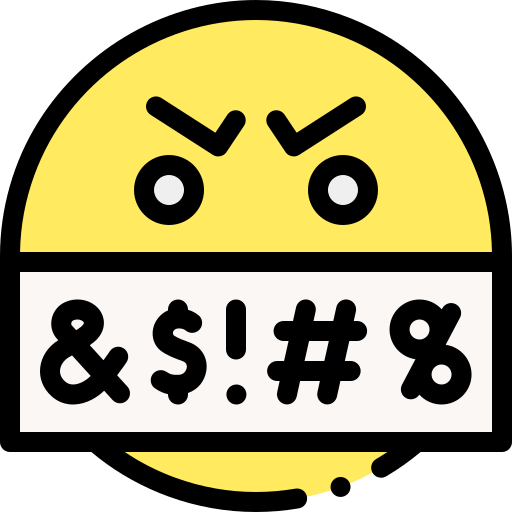

# Swear Jar

### An iOS Voice App built with [Spokestack](https://spokestack.io/)

## About
This is a demo app that uses Spokestack's [cookbook](https://spokestack.io/docs/iOS/cookbook) to create a simplistic digital swear jar using wakewords.

## Contributors
[Anna Sherman](https://github.com/cavewoman)
[John Cotton](https://github.com/thejohncotton)

## Install/Preview:
### Prerequisite: 
Be sure that you have the latest version of xcode installed.

Please use basic human decency and do not use profanity in front of young children without their permission.
### Install 
Clone this repo:
`https://github.com/thejohncotton/swearjar.git`

Install Dependencies:
`cd swearjar && pod install`

Open the `swearjar.xcworkspace` file and build for the simulator.

To test the functionality you can use the following G Rated language:

1. Shirt
1. Fork
1. Fart
1. Speghettios

You may also test with normal american profanities.
